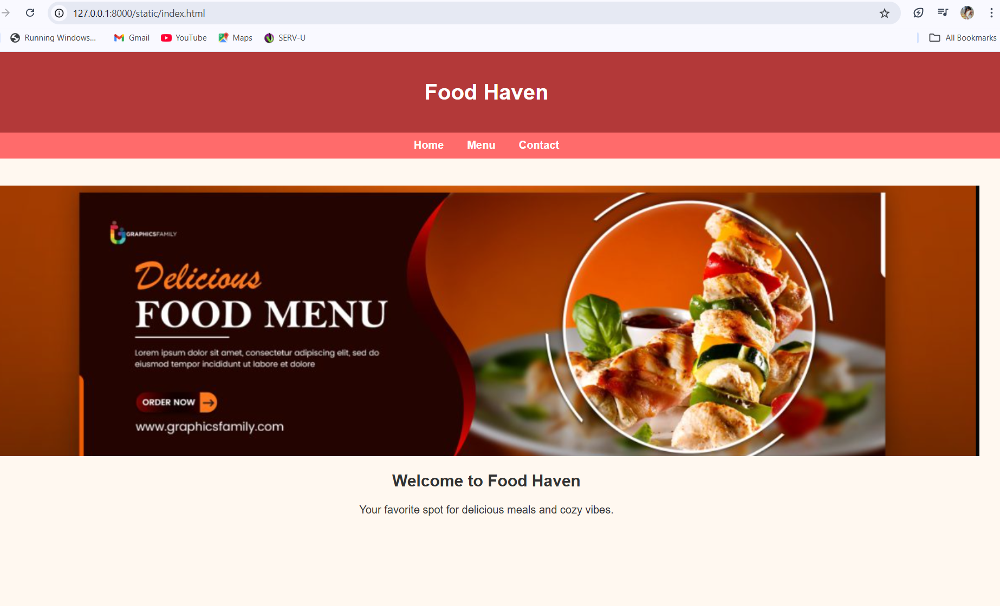
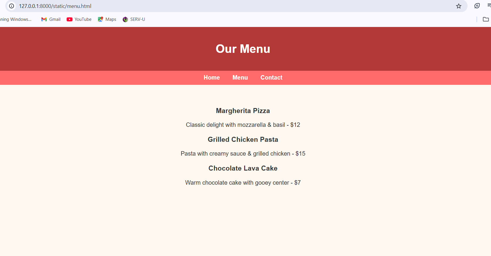
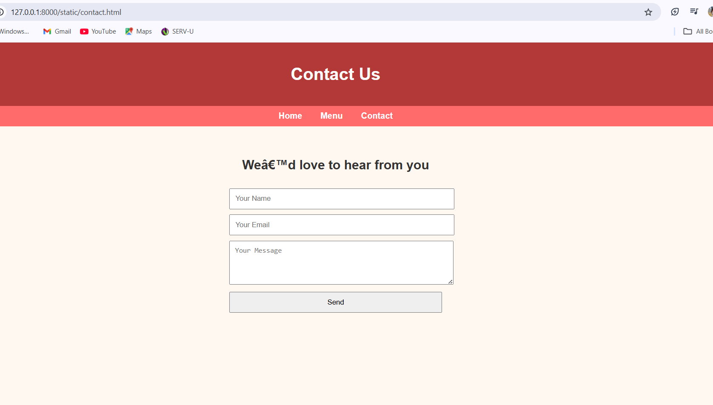

# Ex.07 Restaurant Website
## Date:9.5.25

## AIM:
To develop a static Restaurant website to display the food items and services provided by them.

## DESIGN STEPS:

### Step 1:
Requirement collection.

### Step 2:
Creating the layout using HTML and CSS.

### Step 3:
Updating the sample content.

### Step 4:
Choose the appropriate style and color scheme.

### Step 5:
Validate the layout in various browsers.

### Step 6:
Validate the HTML code.

### Step 7:
Publish the website in the given URL.

## PROGRAM:
```
index.html
<!DOCTYPE html>
<html>
<head>
    <title>Home - Food Haven</title>
    <link rel="stylesheet" href="style.css">
</head>
<body>
    <header><h1>Food Haven</h1></header>
    <nav>
        <a href="index.html">Home</a>
        <a href="menu.html">Menu</a>
        <a href="contact.html">Contact</a>
    </nav>
    <section>
        
        <h2>Welcome to Food Haven</h2>
        <p>Your favorite spot for delicious meals and cozy vibes.</p>
    </section>
</body>
</html>

menu.html
<!DOCTYPE html>
<html>
<head>
    <title>Menu - Food Haven</title>
    <link rel="stylesheet" href="style.css">
</head>
<body>
    <header><h1>Our Menu</h1></header>
    <nav>
        <a href="index.html">Home</a>
        <a href="menu.html">Menu</a>
        <a href="contact.html">Contact</a>
    </nav>
    <section>
        <div class="menu-item">
            <h3>Margherita Pizza</h3>
            <p>Classic delight with mozzarella & basil - $12</p>
        </div>
        <div class="menu-item">
            <h3>Grilled Chicken Pasta</h3>
            <p>Pasta with creamy sauce & grilled chicken - $15</p>
        </div>
        <div class="menu-item">
            <h3>Chocolate Lava Cake</h3>
            <p>Warm chocolate cake with gooey center - $7</p>
        </div>
    </section>
</body>
</html>

contact.html
<!DOCTYPE html>
<html>
<head>
    <title>Contact - Food Haven</title>
    <link rel="stylesheet" href="style.css">
</head>
<body>
    <header><h1>Contact Us</h1></header>
    <nav>
        <a href="index.html">Home</a>
        <a href="menu.html">Menu</a>
        <a href="contact.html">Contact</a>
    </nav>
    <section>
        <h2>We’d love to hear from you</h2>
        <div class="contact-form">
            <input type="text" placeholder="Your Name">
            <input type="email" placeholder="Your Email">
            <textarea rows="4" placeholder="Your Message"></textarea>
            <input type="submit" value="Send">
        </div>
    </section>
</body>
</html>
style.css
body {
    margin: 0;
    font-family: Arial, sans-serif;
    background: #fff8f0;
    color: #333;
}

header {
    background: #b33939;
    color: white;
    padding: 20px 0;
    text-align: center;
}

nav {
    background: #ff6b6b;
    text-align: center;
    padding: 10px 0;
}

nav a {
    color: white;
    margin: 0 15px;
    text-decoration: none;
    font-weight: bold;
}

nav a:hover {
    text-decoration: underline;
}

section {
    padding: 40px;
    text-align: center;
}

img.banner {
    width: 100%;
    max-height: 400px;
    object-fit: cover;
}

.menu-item {
    margin: 20px 0;
}

.contact-form {
    max-width: 400px;
    margin: auto;
}

input, textarea {
    width: 100%;
    padding: 10px;
    margin-top: 10px;
}
```
## OUTPUT:




## RESULT:
The program for designing software company website using HTML and CSS is completed successfully.
